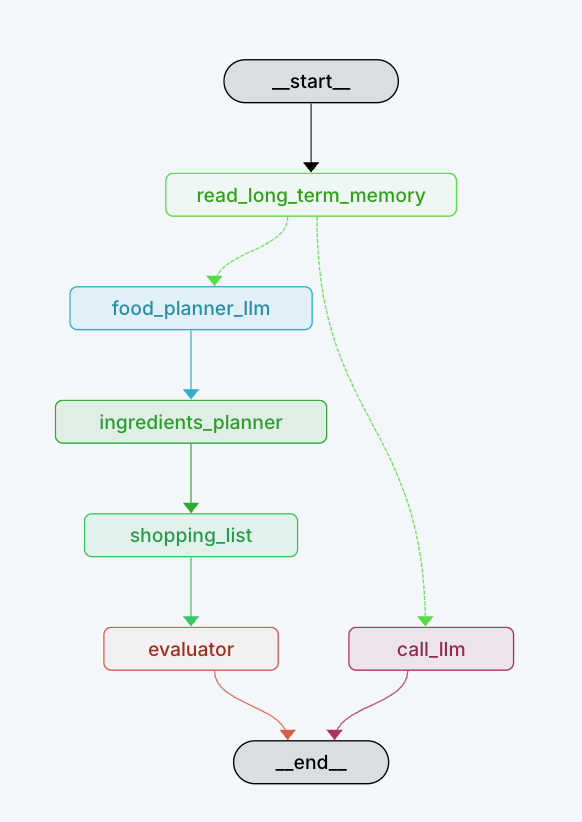

##### Agent Roadmap

First, we gonna implement the goal of the agent:

1. The agent gonna be able to make search at specific sites
2. The agent will retrieve information from stores and gonna have user information saved
3. The agent has the context of the user, his diet, his goal, from where he is, and his preferences.
4. We gonna have the sport that the user is doing.

I want to use a good technical infrastructure, I need to know how to create a good AI Agent for this.

Tengo un problema, y es que no se como va a ir la estructura del agente.

Para empezar, necesito saber cual es el objetivo que tengo que lograr.

Primero le pregunto al usuario quien es él, necesito información para poder generar un plan de comida adecuado.

El agente tiene que siempre consultar los datos del usuario antes de generar un plan de comida, me las tengo que ingeniar sobre como pedirle las preferencias al usuario.

Primero, necesito preguntar con un agente, las preferencias del usuario.

Ese agente, tendrá la información del usuario, se pasará al siguiente nodo.

Ese nodo, ya podrá tener la información del usuario, y podrá generar la respuesta de manera adecuada.

El problema, es cuando lo tengamos que volver a ejecutar, si creamos un nodo determinado que pregunte siempre las preferencias del usuario, no es nada eficiente, por lo tanto, el nodo ya debe de incluir con una información pasada ya de antemano.

